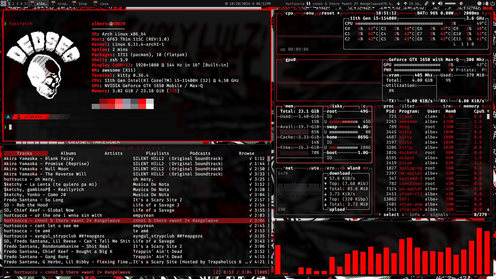
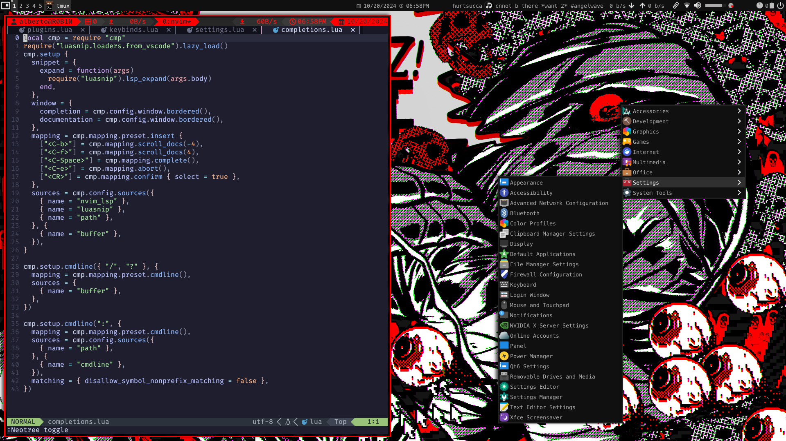

# Awesome WM

## Preview



Make sure you have [awesome-wm-widgets](https://github.com/streetturtle/awesome-wm-widgets.git) in your `awesome/` folder

```
cd .config/awesome
git clone https://github.com/streetturtle/awesome-wm-widgets.git
```
