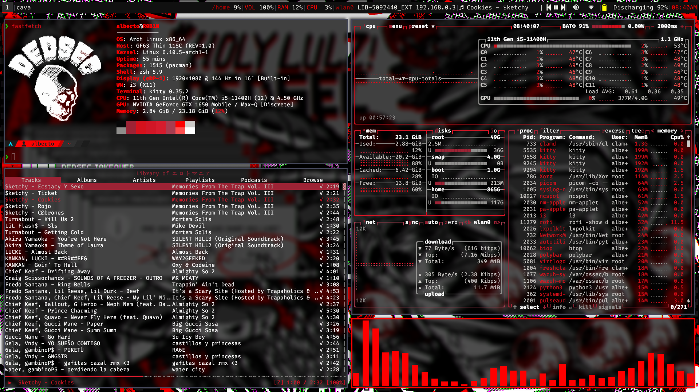

# What's this?
These are my dotfiles for my main laptop. This one has way more plugins and configs than the main branch.
# Structure
```
.
├── .config
│   ├── alacritty
│   │   ├── alacritty.toml
│   │   └── themes
│   │       ├── dracula.toml
│   │       ├── wlr.toml
│   │       └── wpg.toml
│   ├── cava
│   │   └── config
│   ├── i3
│   │   └── config
│   ├── i3status
│   │   └── config
│   ├── lf
│   │   ├── colors
│   │   ├── icons
│   │   └── lfrc
│   ├── lf-ueberzug
│   │   ├── colors
│   │   ├── icons
│   │   └── lfrc-ueberzug
│   ├── nvim
│   │   ├── init.lua
│   │   ├── lua
│   │   │   ├── completions.lua
│   │   │   ├── configs
│   │   │   │   ├── lspconfig.lua
│   │   │   │   ├── lualine.lua
│   │   │   │   └── telescope.lua
│   │   │   ├── plugins.lua
│   │   │   └── settings.lua
│   │   ├── README.md
│   │   └── .stylua.toml
│   ├── picom
│   │   └── picom.conf
│   ├── polybar
│   │   └── config.ini
│   ├── ranger
│   │   ├── rc.conf
│   │   └── rifle.conf
│   ├── rofi
│   │   ├── config.rasi
│   │   ├── power.rasi
│   │   ├── wifi
│   │   └── wpg.rasi
│   ├── scripts
│   │   ├── lf-ueberzug
│   │   ├── lf-ueberzug-cleaner
│   │   └── lf-ueberzug-previewer
│   ├── tmux
│   │   └── tmux.conf
│   ├── wpg
│   │   ├── templates
│   │   │   ├── alacritty.base
│   │   │   └── wpg.rasi.base
│   │   └── wpg.conf
│   └── zsh
│       ├── .p10k.zsh
│       ├── .zsh_aliases
│       ├── .zshenv
│       └── .zshrc
├── README.md
└── screenshot.png
```
# Setup
NOTE: My zsh files are in $HOME/.config/zsh
The setup doesn't change much, just the clone command.
## Requirements
- i3
- picom
- nitrogen
- stow
- zsh + ohmyzsh
## Installation
Clone the repo and cd into it
```
git clone -b red https://github.com/arosario513/dotfiles.git
cd dotfiles
```
Then, run this command:
```
stow .
```
Now have fun with your cool new setup
