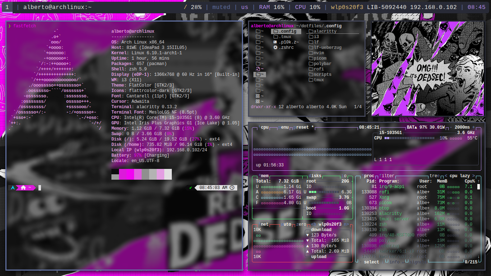

# Components
-  WM: [i3](https://github.com/i3/i3.git)
- Composer: [picom](https://github.com/yshui/picom.git)
- Terminal: [alacritty](https://github.com/alacritty/alacritty.git)
- Bar: [polybar](https://github.com/polybar/polybar.git)
- File Manager: [lf](https://github.com/gokcehan/lf.git) + [lf-gadgets](https://github.com/slavistan/lf-gadgets.git)
- Colors: [wpgtk](https://github.com/deviantfero/wpgtk.git)
- Editor: [neovim](https://github.com/neovim/neovim.git)
- Dotfile Manager: [stow](https://git.savannah.gnu.org/git/stow.git) (optional)
# Installation
Make sure that you have stow installed, otherwise good luck doing the setup manually.
## Arch
```
sudo pacman -S stow
```
Clone the repo, and cd into it.
```
git clone https://github.com/arosario513/dotfiles.git
cd dotfiles
```
Run the following command:
```
stow .
```
If everything goes well, the configs are symlinked in the right directories.
# Conclusion
Dotfiles are awesome!
