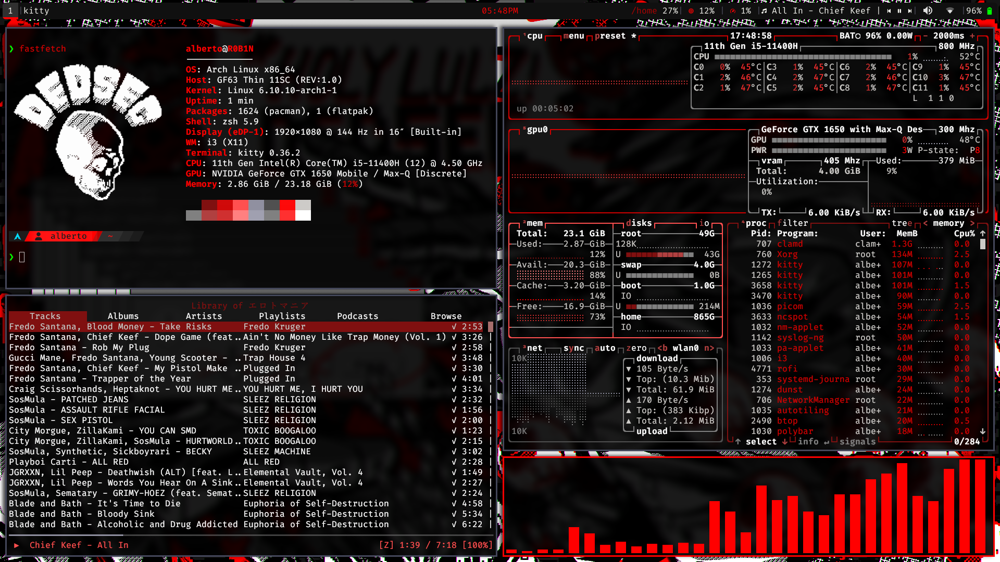

# What's this?
These are my dotfiles for my main laptop. This one has way more plugins and configs than the main branch.
# What I used in the screenshot
- i3
- kitty
- starship
- picom
- cava
- freshfetch
- polybar
- btop
- ncspot
- nitrogen
- zsh + ohmyzsh
# Setup
NOTE: My zsh files are in $HOME/.config/zsh
The setup doesn't change much, just the clone command.
## Installation
Clone the repo and cd into it
```
git clone -b red https://github.com/arosario513/dotfiles.git
cd dotfiles
```
Then, run this command:
```
stow .
```
Now have fun with your cool new setup
